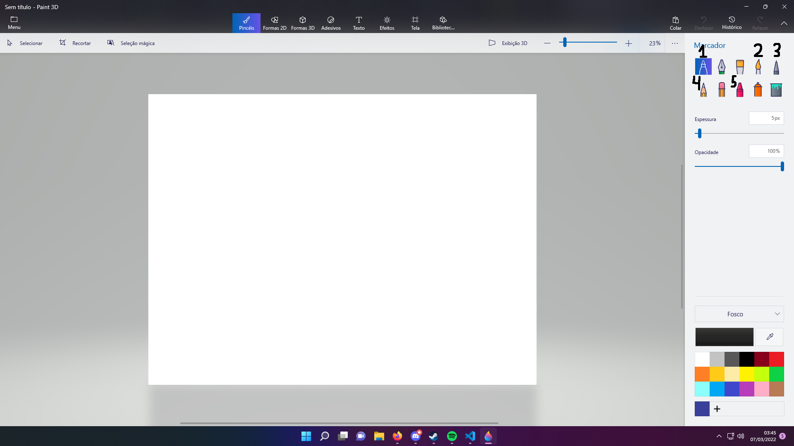
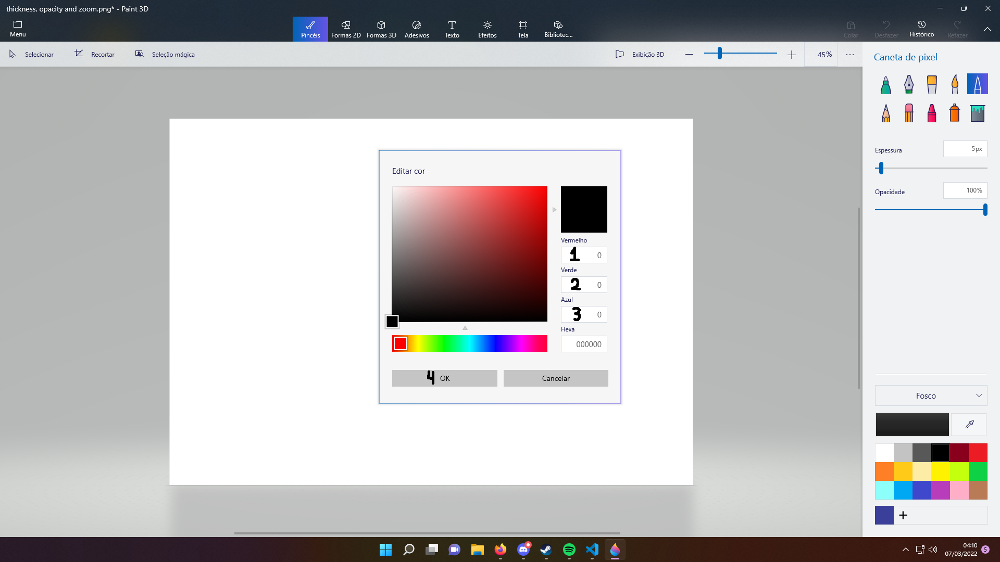
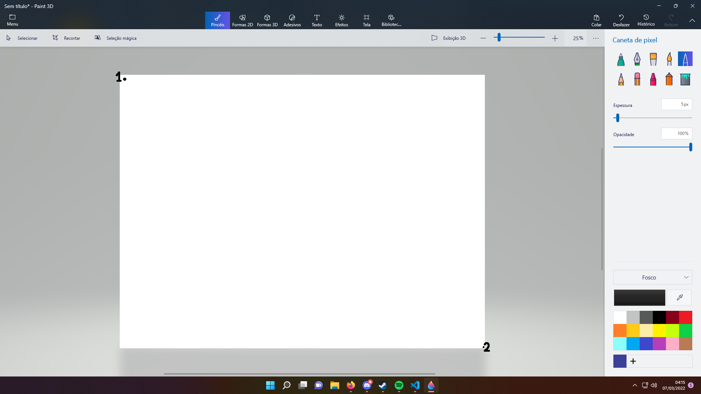
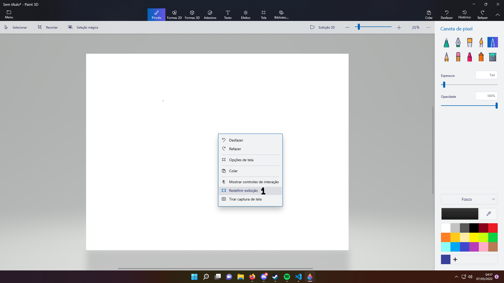

<h1 align="center">Positions</h1>

Every position on the [positions.json](../res/positions.json) represents a Paint 3D XY position of an UI element. The cursor will move towards the coordinate, then interact. The default file should look like this:
```json
{
    "toolMarker": {
      "x": 1700,
      "y": 161
    },
    "toolWatercolor":{
      "x": 1834,
      "y": 161
    },
    "toolPixelPencil": {
      "x": 1876,
      "y": 161
    },
    "toolGraphitePencil": {
      "x": 1700,
      "y": 215
    },
    "toolCrayon": {
      "x": 1790,
      "y": 215
    },
    "boxBrushSize": {
      "x": 1866,
      "y": 284
    },
    "boxBrushOpacity": {
      "x": 1866,
      "y": 364
    },
    "boxZoom": {
      "x": 1575,
      "y": 100
    },
    "buttonSelectedColorPreview": {
      "x": 1751,
      "y": 814
    },
    "selectColorRed": {
      "x": 1145,
      "y": 487
    },
    "selectColorGreen": {
      "x": 1145,
      "y": 545
    },
    "selectColorBlue": {
      "x": 1145,
      "y": 602
    },
    "selectColorOkButton": {
      "x": 858,
      "y": 726
    },
    "canvasTopLeftCorner": {
      "x": 336,
      "y": 215
    },
    "canvasBottomRightCorner": {
      "x": 1324,
      "y": 948
    },
    "contextRedefineCanvas": {
      "x": 100,
      "y": 210
    }
  }
```
---
## Setting up the coordinates
If you need some help getting the XY coordinates of Paint 3D UI elements, there is the [Coordinate Getter tool](../tools/coordinategetter.js).

### "toolMarker", **"toolWatercolor", "toolPixelPencil", "toolGraphitePencil" & "toolCrayon"
These values represents the XY positions of the tools, respectively. They are located at the top right corner of Paint 3D. The coordinate must be at the center of the tool box:


### "boxBrushSize", "boxBrushOpacity", "boxZoom" & "buttonSelectedColorPreview"
Represents respectively the XY positions of these four values' boxes. They're located at the right corner. Coordinates must be at the center of the box:


### "selectColorRed", "selectColorGreen", "selectColorBlue" & "selectColorOkButton"
If you left click on the [buttonSelectedColorPreview](#"boxbrushsize"-"boxbrushopacity"-"boxzoom"--"buttonselectedcolorpreview") (element #4), a color selector will open. "selectColorRed", "selectColorGreen", "selectColorBlue" and "selectColorOkButton" represents XY positions inside this color selector. Respectively, the elements are located at:


### "canvasTopLeftCorner" & "canvasBottomRightCorner"
Represents the two edges of the canvas. The points should be located at the edge of your canvas. Respectively - in my case - they are:


### "contextRedefineCanvas"
If you right click somewhere in the canvas, a context menu will open. Once clicked, there will be an option to "Redefine the Canvas". This coordinate is **relative to the place where you right clicked**. The relative point is located below:
